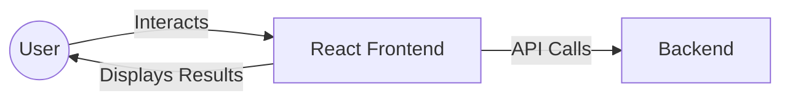
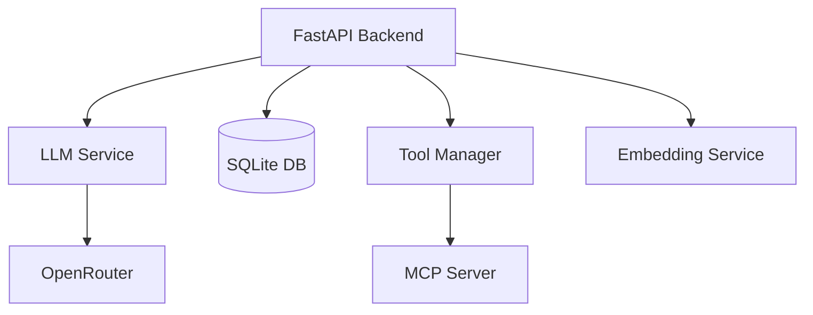
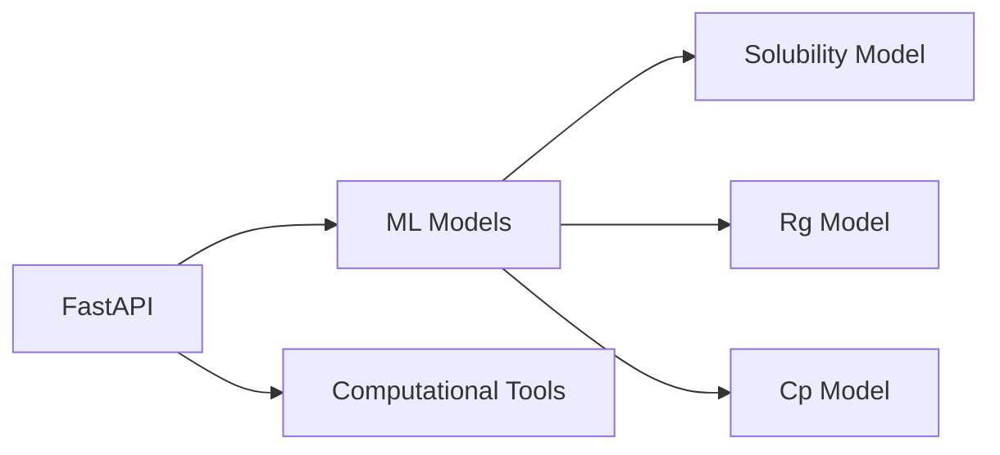

# MatAgent ✨ Key Features:

| Feature | Description |
|---------|------------|
| 🤖 **Intelligent Agent Orchestration** | An advanced AI agent understands user queries, plans actions, and orchestrates the use of appropriate tools and ML models |
| 🧬 **Material Property Prediction** | Integrates with specialized machine learning models to predict critical material properties such as aqueous solubility, radius of gyration (Rg), and heat capacity (Cp) |
| 💻 **User-Friendly Interface** | A responsive web frontend provides an intuitive chat-based interface for seamless interaction with the AI assistant |
| 🔧 **Modular and Scalable Architecture** | Built with a microservices approach using FastAPI for the backend and MCP server, ensuring maintainability and scalability |
| 🐳 **Containerized Deployment** | Utilizes Docker and Docker Compose for easy, consistent, and reproducible deployment across different environments |terials Science Assistant

<div align="center">

[](https://fastapi.tiangolo.com/)
[](https://reactjs.org/)
[](https://www.docker.com/)
[](https://www.python.org/)
[](LICENSE)

🧪 Revolutionizing materials science research with AI-powered property predictions
</div>

## 🌟 Project Introduction

MatAgent is an innovative AI-powered platform designed to revolutionize materials science and chemistry research. It acts as an intelligent assistant, leveraging the power of large language models (LLMs) to interact with specialized machine learning models and computational tools. The primary goal of MatAgent is to empower researchers by providing on-demand predictions for various material properties based on molecular structures (e.g., SMILES strings), streamlining the research and development process.


### ✨ Key Features:
- **Intelligent Agent Orchestration:** An advanced AI agent understands user queries, plans actions, and orchestrates the use of appropriate tools and ML models.
- **Material Property Prediction:** Integrates with specialized machine learning models to predict critical material properties such as aqueous solubility, radius of gyration (Rg), and heat capacity (Cp).
- **User-Friendly Interface:** A responsive web frontend provides an intuitive chat-based interface for seamless interaction with the AI assistant.
- **Modular and Scalable Architecture:** Built with a microservices approach using FastAPI for the backend and MCP server, ensuring maintainability and scalability.
- **Containerized Deployment:** Utilizes Docker and Docker Compose for easy, consistent, and reproducible deployment across different environments.

### 🏗️ Architecture Overview

The MatAgent platform is built on a modern microservices architecture, orchestrated using Docker Compose. Here's a detailed look at each component:

#### 🌐 Frontend (React.js)

- 🎨 Modern, responsive web application built with React.js
- 💬 Intuitive chat interface for natural interaction
- 🔄 Real-time updates and response streaming

#### 🧠 Backend (FastAPI)

- 🚀 High-performance FastAPI application
- 🤖 Advanced AI agent orchestration
- 💾 Efficient conversation management
- 🔍 Smart tool discovery and execution
- 🧮 Embedding-based context understanding

#### ⚗️ MCP Server (FastAPI)

- 🧪 Specialized materials science calculations
- 📊 Pre-trained ML models for property prediction
- 🔌 Extensible tool and model architecture
- 🛠️ RESTful API endpoints for all features

## How It Works:

1.  A user enters a query (e.g., "What is the aqueous solubility of ethanol (CCO)?") into the Frontend.
2.  The Frontend sends the query to the Backend API.
3.  The Backend's AI agent processes the query using the LLM.
4.  The LLM, guided by the agent's logic, identifies the need for a specific tool (e.g., `predict_aqueous_solubility`).
5.  The agent calls the corresponding API endpoint on the MCP Server, passing the necessary parameters (e.g., SMILES string "CCO").
6.  The MCP Server executes its internal ML model to predict the property and returns the result to the Backend.
7.  The Backend's AI agent integrates this result into a coherent response and sends it back to the Frontend.
8.  The Frontend displays the AI's response, including the predicted property value, to the user.

## 🚀 Quick Start Guide

MatAgent provides a one-click setup script that automates the entire configuration and deployment process.

### 📋 Prerequisites

Before you begin, make sure you have:

| Requirement | Description |
|------------|-------------|
| 🐳 Docker Desktop | Includes Docker Engine and Docker Compose. [Download here](https://www.docker.com/products/docker-desktop/) |
| 🔑 OpenRouter API Key | Required for LLM access. [Get your key here](https://openrouter.ai/keys) |

### ⚡ One-Click Setup

The easiest way to get MatAgent running is using our automated setup script:

```bash
# Clone the repository
git clone <repository-url>
cd MatAgent

# Make the script executable
chmod +x setup.sh

# Run the one-click setup
./setup.sh
```

The setup script will:
- ✅ Check Docker environment
- 🔑 Configure OpenRouter API Key interactively
- 📁 Create necessary directories
- 🏗️ Build and start all services
- 🌐 Open the application at http://localhost

### 🔧 Manual Setup (Alternative)

If you prefer manual configuration:

1. **Create environment file**:
```bash
# Create .env file with your API key
echo "OPENROUTER_API_KEY=your_actual_api_key_here" > .env
```

2. **Start services**:
```bash
# Build and start all services
docker-compose up --build -d

# Check service status
docker-compose ps
```

### 🛠️ Management Commands

The setup script provides convenient management options:

```bash
# Show help
./setup.sh --help

# Stop all services
./setup.sh --stop

# Restart services
./setup.sh --restart

# View service logs
./setup.sh --logs

# Check service status
./setup.sh --status
```

### 🌐 Access the Application

Once setup is complete, you can access MatAgent at:

- **Frontend UI**: http://localhost
- **Backend API**: http://localhost:8000
- **Health Check**: http://localhost:8000/api/health

### 🔧 Troubleshooting

If you encounter any issues:

1. **Port conflicts**: Use `sudo lsof -i :80 :8000 :8080` to check port usage
2. **Docker build fails**: Try `docker system prune -f` and rebuild
3. **API Key issues**: Edit the `.env` file and restart services
4. **View logs**: Use `./setup.sh --logs` or `docker-compose logs -f`

## 🎮 Usage Examples

### Basic Material Property Prediction

Ask MatAgent questions like:
- "What is the aqueous solubility of ethanol (CCO)?"
- "Predict the radius of gyration for benzene"
- "Calculate the heat capacity of water (O)"

### Advanced Queries

- "Compare the solubility of ethanol and methanol"
- "What factors affect the radius of gyration of polymers?"
- "Explain the relationship between molecular structure and heat capacity"

## � Demo

> 💡 Here you can add screenshots or GIFs demonstrating the key features of MatAgent:
> - Chat interface and interactions
> - Property prediction examples
> - Real-time response streaming
> - Tool execution visualization

---

## 📄 License

This project is licensed under the MIT License - see the [LICENSE](LICENSE) file for details.

---
