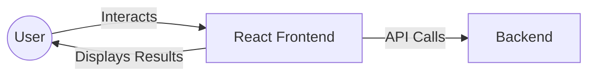
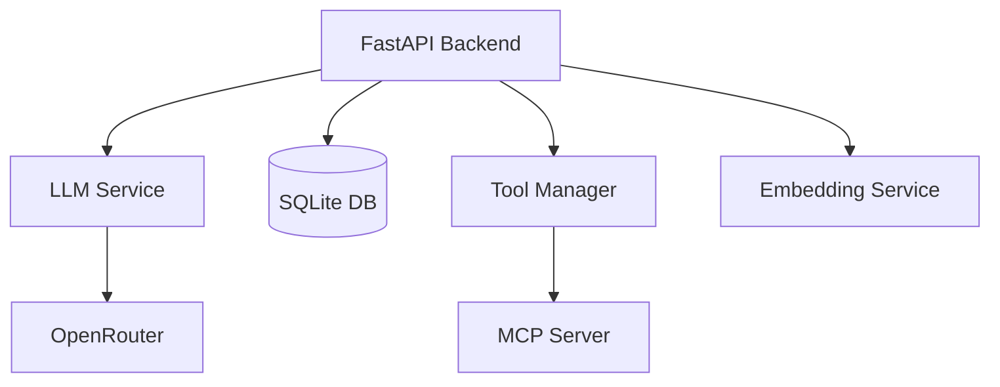
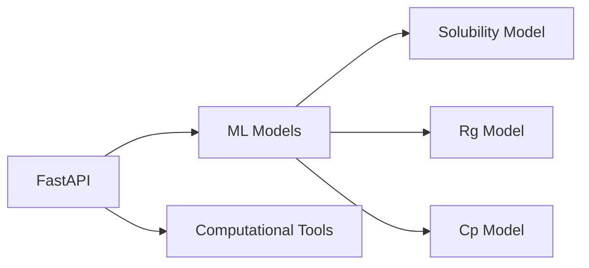

# MatAgent: AI-Powe### ✨ Key Features:

| Feature | Description |
|---------|------------|
| 🤖 **Intelligent Agent Orchestration** | An advanced AI agent understands user queries, plans actions, and orchestrates the use of appropriate tools and ML models |
| 🧬 **Material Property Prediction** | Integrates with specialized machine learning models to predict critical material properties such as aqueous solubility, radius of gyration (Rg), and heat capacity (Cp) |
| 💻 **User-Friendly Interface** | A responsive web frontend provides an intuitive chat-based interface for seamless interaction with the AI assistant |
| 🔧 **Modular and Scalable Architecture** | Built with a microservices approach using FastAPI for the backend and MCP server, ensuring maintainability and scalability |
| 🐳 **Containerized Deployment** | Utilizes Docker and Docker Compose for easy, consistent, and reproducible deployment across different environments |terials Science Assistant

<div align="center">

[](https://fastapi.tiangolo.com/)
[](https://reactjs.org/)
[](https://www.docker.com/)
[](https://www.python.org/)
[](LICENSE)

🧪 Revolutionizing materials science research with AI-powered property predictions
</div>

## 🌟 Project Introduction

MatAgent is an innovative AI-powered platform designed to revolutionize materials science and chemistry research. It acts as an intelligent assistant, leveraging the power of large language models (LLMs) to interact with specialized machine learning models and computational tools. The primary goal of MatAgent is to empower researchers by providing on-demand predictions for various material properties based on molecular structures (e.g., SMILES strings), streamlining the research and development process.


### ✨ Key Features:
- **Intelligent Agent Orchestration:** An advanced AI agent understands user queries, plans actions, and orchestrates the use of appropriate tools and ML models.
- **Material Property Prediction:** Integrates with specialized machine learning models to predict critical material properties such as aqueous solubility, radius of gyration (Rg), and heat capacity (Cp).
- **User-Friendly Interface:** A responsive web frontend provides an intuitive chat-based interface for seamless interaction with the AI assistant.
- **Modular and Scalable Architecture:** Built with a microservices approach using FastAPI for the backend and MCP server, ensuring maintainability and scalability.
- **Containerized Deployment:** Utilizes Docker and Docker Compose for easy, consistent, and reproducible deployment across different environments.

### 🏗️ Architecture Overview

The MatAgent platform is built on a modern microservices architecture, orchestrated using Docker Compose. Here's a detailed look at each component:

#### 🌐 Frontend (React.js)

- 🎨 Modern, responsive web application built with React.js
- 💬 Intuitive chat interface for natural interaction
- 🔄 Real-time updates and response streaming

#### 🧠 Backend (FastAPI)

- 🚀 High-performance FastAPI application
- 🤖 Advanced AI agent orchestration
- 💾 Efficient conversation management
- 🔍 Smart tool discovery and execution
- 🧮 Embedding-based context understanding

#### ⚗️ MCP Server (FastAPI)

- 🧪 Specialized materials science calculations
- 📊 Pre-trained ML models for property prediction
- 🔌 Extensible tool and model architecture
- 🛠️ RESTful API endpoints for all features

## How It Works:

1.  A user enters a query (e.g., "What is the aqueous solubility of ethanol (CCO)?") into the Frontend.
2.  The Frontend sends the query to the Backend API.
3.  The Backend's AI agent processes the query using the LLM.
4.  The LLM, guided by the agent's logic, identifies the need for a specific tool (e.g., `predict_aqueous_solubility`).
5.  The agent calls the corresponding API endpoint on the MCP Server, passing the necessary parameters (e.g., SMILES string "CCO").
6.  The MCP Server executes its internal ML model to predict the property and returns the result to the Backend.
7.  The Backend's AI agent integrates this result into a coherent response and sends it back to the Frontend.
8.  The Frontend displays the AI's response, including the predicted property value, to the user.

## 🚀 Quick Start Guide

MatAgent is designed for easy deployment using Docker and Docker Compose.

### 📋 Prerequisites

Before you begin, make sure you have:

| Requirement | Description |
|------------|-------------|
| 🐳 Docker Desktop | Includes Docker Engine and Docker Compose. [Download here](https://www.docker.com/products/docker-desktop/) |
| 🔑 API Key | OpenRouter API key for LLM services |
| 💻 System | Any OS that supports Docker (Windows/Mac/Linux) |
| 🌐 Internet | Active internet connection for API calls |

### 🔧 Environment Setup

You need to set up an API key for the LLM service (e.g., OpenRouter). Create a `.env` file in the `backend/` directory with the following content:

```
OPENROUTER_API_KEY=your_openrouter_api_key_here
```

Replace `your_openrouter_api_key_here` with your actual API key.

### Steps to Deploy

1.  **Clone the Repository:**
    If you haven't already, clone the MatAgent repository to your local machine:
    ```bash
    git clone https://github.com/tom-wang813/MatAgent.git
    cd matagent
    ```
    (Note: Replace `https://github.com/your-repo/matagent.git` with the actual repository URL if different.)

2.  **Build and Run with Docker Compose:**
    Navigate to the root directory of the cloned repository (where `docker-compose.yml` is located) and run the following command:

    ```bash
    docker-compose up --build
    ```
    *   `--build`: This flag ensures that Docker rebuilds the images for all services (frontend, backend, mcp_server) if there are any changes in the Dockerfiles or dependencies. It's good practice to include this the first time you run it or after pulling updates.

    This command will:
    *   Build the Docker images for the `frontend`, `backend`, and `mcp_server` services.
    *   Start all three services in detached mode (you'll see logs in your terminal).
    *   The `backend` service will wait for the `mcp_server` to be ready.
    *   The `frontend` service will wait for the `backend` to be ready.

3.  **Access the Application:**
    Once all services are up and running, you can access the MatAgent frontend in your web browser:

    *   **Frontend:** `http://localhost`

    The frontend is configured to run on port 80, and Docker Compose maps this to your host's port 80.

4.  **Verify Services (Optional):**
    You can check the status of individual services:
    *   **Backend Health Check:** `http://localhost:8000/api/health` (You should see a success message)
    *   **MCP Server Health Check:** `http://localhost:8080/` (You should see "MCP Server is running")

### Stopping the Application

To stop all running services and remove the containers, networks, and volumes created by `docker-compose up`:

```bash
docker-compose down
```

If you want to stop and remove volumes (e.g., for a clean start of the database), use:

```bash
docker-compose down -v
```

This will remove the `matagent.db` file created by the backend, allowing for a fresh database on the next `docker-compose up`.

## 🎮 Demo

> 💡 Here you can add screenshots or GIFs demonstrating the key features of MatAgent:
> - Chat interface and interactions
> - Property prediction examples
> - Real-time response streaming
> - Tool execution visualization

## 📄 License
This project is licensed under the MIT License - see the LICENSE file for details.
